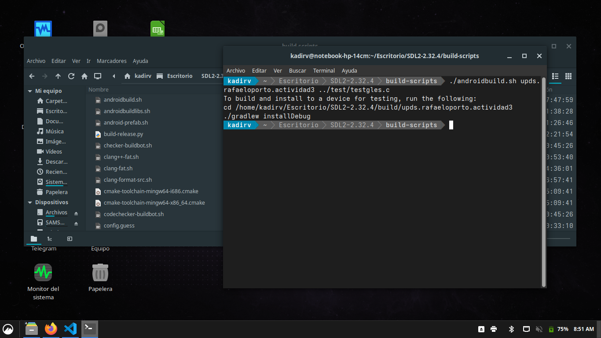
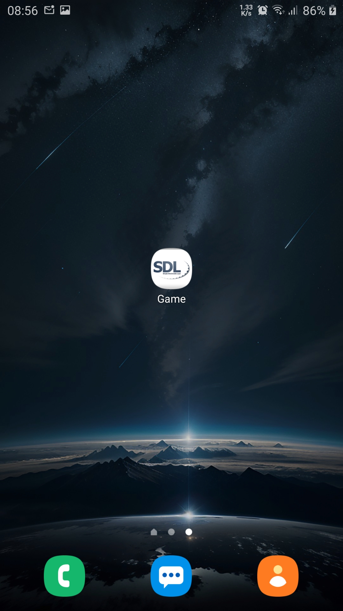

# Actividad 2 - Aplicaciones Móviles

## Modificaciona a un repositorio de github de aplicacion movil
La modificacion se realizo en base a un sample de SDL2, una libreria grafica multiplataforma
## Repositorio original: https://github.com/libsdl-org/SDL
## Version: 2.32.4

---
## 1. Repositorio original

## 2. Pasos para compilar un proyecto android

## 3. Ejecutando scripts para android

## 4. Compilando debug

## 5. Compilacion terminada

## 6. Aplicacion sin cambios

## 7. Ejecutando aplicacion

## 8. Codigo fuente de la aplicacion en lenguaje c

## 9. Modificacion en los vertices de la figura mostrada

## 10. Cambiando nombre de aplicacion a "Actividad 3 Aplicaciones Moviles"

## 11. Compilando nuevamente

## 12. Aplicacion con nombre distinto

## 13. Ejecutando aplicacion con los nuevos cambios

---

**Autor:** Rafael Kadir Oporto Valencia
**Fecha:** 19/08/2025
